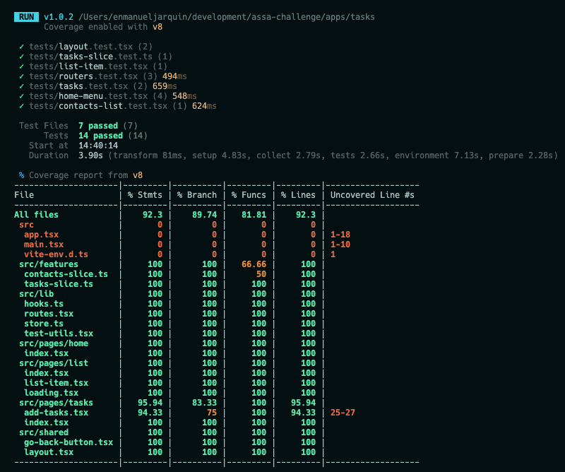

# ASSA Challenge

  

  

## What's inside?

  

  

This project is a [Monorepo](https://monorepo.tools/) solution, and it uses [Turborepo](https://turbo.build/repo), it includes the following packages/apps:

  

  

### Apps and Packages

  

  

-  `docs`: a [ReacJS](https://react.dev/) app built with [Storybook](https://storybook.js.org/) , and [Tailwindcss](https://tailwindcss.com/)

-  `tasks`: a [ReacJS](https://react.dev/) app built with [Vite](https://vitejs.dev/) , and [Tailwindcss](https://tailwindcss.com/)

  

-  `ui`: A [design system](https://www.invisionapp.com/inside-design/guide-to-design-systems/) that uses [ReactJS](https://react.dev/) to create a component library shared by `front` and others.

  

-  `eslint-config-custom`: `eslint` configurations (includes `eslint-config-next` and `eslint-config-prettier`)

  

-  `tsconfig`: Used throughout the monorepo

  

-  `tailwindcss-config`: Reuse tailwindcss configuration.

  

  

### Stack

  

- Monorepository with [Turborepo](https://turbo.build/repo).

  

  

- [design system](https://www.invisionapp.com/inside-design/guide-to-design-systems/) to create reusable components.

- [ReactJS](https://react.dev/)

- [Tailwindcss](https://tailwindcss.com/)

- [Turborepo](https://turbo.build/repo)

- [Redux-toolkit](https://redux-toolkit.js.org/)

  

Each package/app is 100% [TypeScript](https://www.typescriptlang.org/).

  

  

### Utilities

  

  

Some additional tools already setup for you:

  

  

- [TypeScript](https://www.typescriptlang.org/) for static type checking

  

- [ESLint](https://eslint.org/) for code linting

  

- [Prettier](https://prettier.io) for code formatting

  

  

### Build

  

  

To build all apps and packages, run the following command:

  

  

```

  

cd assa-challenge

  

npm install

  

npm run build

  

```

  

  

### Run locally

  

  

1. Clone the repository

  

```

  

https://github.com/TheEnmanuel23/assa-challenge.git

  

```

  

2. Install dependencies:

  

```

cd assa-challenge
npm install

  

```

  

3. Add environment variables (**Frontend**)

  

Rename the file `.env.example` in the `./apps/tasks` directory, then add these variables to `.env`:

  

The endpoint used for this challenge was `"https://6172cfe5110a740017222e2b.mockapi.io/elements"` but sometimes it doesn't work, so in case this doesn't work, I have created a mock api.

  

To run **MOCK API**, you need to replace the VITE_API value with:

`"http://localhost:3000/contacts"`

  

Then, in the root direct run the script:

`npm run mock-api`

  
  

4. Then in the root directory, run the command :

  

```

  

npm run dev

  

```

  

  

That command will run all the apps (docs and tasks)

  

```

  

tasks: http:localhost:<random port>

docs: http://localhost:6006

```

6. Run tests:

You can run `npm run tests` in the root directory or navigate to the `app/tasks` directory then run the same script as before.

Besides, you could get the coverage report by running:

`npm run coverage` in the same directory.

  
  

